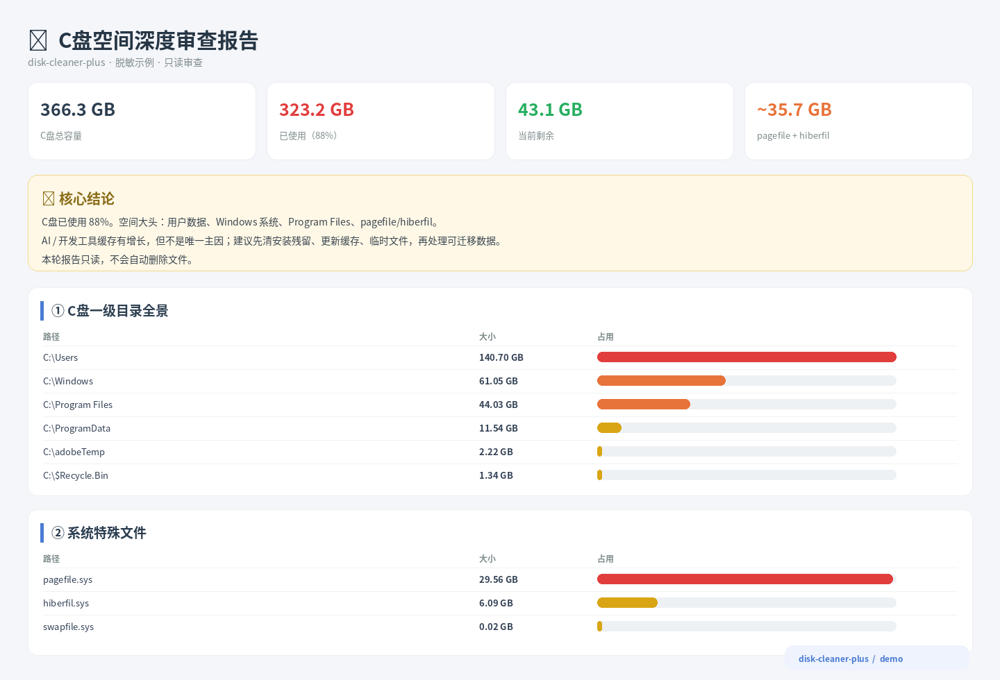

# disk-cleaner-plus

> Windows 全盘深度审查 + AI 辅助激进清理 Skill。先看清楚空间去哪了，再决定哪些内容迁移、卸载、进回收站，哪些可以直接硬删。



`disk-cleaner-plus` 面向 Codex / 本地 AI Agent，重点解决 Windows 磁盘长期使用后常见的空间混乱：C 盘 AppData 膨胀、软件更新安装包残留、下载目录堆积、重复大文件、聊天软件缓存、开发工具缓存，以及“明明没存多少文件但系统盘一直变小”这类问题。

它不是传统的一键“系统优化工具”。核心流程是：

**只读扫描 → 深度审查 → AI 判断与分级 → 用户确认 → 批量清理 / 迁移 / 卸载 → 复扫核验。**

当前版本：`v1.2.0`

## 主要能力

- **全盘扫描**：覆盖 C、D、E、F 等固定磁盘，统计容量、常见目录、大文件、安装包、压缩包和重复文件。
- **C 盘深度审查**：当系统盘压力较大时，继续下钻 Users、AppData、Windows、Program Files、ProgramData 等大目录，并识别 pagefile / hiberfil、更新缓存、AI Agent 日志等特殊占用。
- **AI 分级决策**：
  - 🟢 **可清理**：临时文件、缓存、冗余安装包、更新残留、明确重复文件等。
  - 🟡 **可迁移**：桌面、下载、视频、项目归档等用户大文件。
  - 🟠 **先改设置**：微信、QQ、WPS、OneDrive、Conda、Docker、WSL 等应优先通过软件设置迁移的数据。
  - 🔴 **禁止直接处理**：Windows 核心目录、Program Files、系统虚拟内存、虚拟磁盘等。
- **交互式 HTML Dashboard**：浏览器本地打开，支持查看路径、移入回收站、勾选批处理。
- **激进清理模式**：对已经确认是垃圾的高文件数缓存，可使用 `rmdir /s /q` 整目录硬删或多线程并发删除，绕过回收站。
- **清理日志与复扫**：记录实际操作，再次统计磁盘空间，明确每一部分释放了多少。

## 这个 Skill 的“激进”是什么意思

`disk-cleaner-plus` 并不把所有删除都强制塞进回收站。

对于数万到数十万个已经确认无价值的小缓存文件，回收站本身可能成为删除瓶颈。此时 Skill 支持：

1. **DIR Wipe**：使用 Windows 原生 `rmdir /s /q` 整目录硬删；
2. **Multi-threaded Delete**：散落文件使用多线程并发 `os.remove()`；
3. **先移后炸**：先抽出少量需要保留的文件，再整体删除旧缓存目录，最后移回保留项；
4. **可选 Defender 临时排除**：仅在用户明确同意时，对可信、范围明确的高频缓存目录临时加入 Windows Defender 排除项，加速大量小文件删除，完成后可移除排除。

硬删除**不可恢复**。Skill 的设计不是“永远保守”，而是：**先审查，目标确认之后可以很果断。**

## 项目结构

```text
disk-cleaner-plus/
├── SKILL.md                  # Agent 工作流与执行边界
├── README.md
├── THIRD_PARTY_NOTICES.md
├── install-local.ps1         # 一键安装到当前用户的 Codex Skills
├── agents/
│   └── openai.yaml           # Codex / ChatGPT Skill 元数据
├── scripts/
│   ├── scan.ps1              # Windows 全盘只读扫描
│   ├── analyze.py            # 分类分析
│   ├── build_report.py       # 静态 HTML 报告
│   ├── server.py             # 本地 Dashboard + 操作 API
│   └── fast_delete.py        # 高文件数目录极速硬删
├── assets/
│   └── report_template.html
└── docs/
    ├── demo-c-drive-report.html
    └── images/
        └── c-drive-audit-preview.png
```

运行时生成的 `scan.json`、`analysis.json`、日志和真实审查报告不会进入 Git 仓库。

## 安装到 Codex

Codex 当前会从用户级 `$HOME/.agents/skills` 读取个人 Skill。Windows 下通常就是：

```text
C:\Users\<你的用户名>\.agents\skills\
```

### 方法 1：直接复制文件夹

把整个 `disk-cleaner-plus` 文件夹复制为：

```text
C:\Users\<你的用户名>\.agents\skills\disk-cleaner-plus\
```

确保最终结构是：

```text
C:\Users\<你的用户名>\.agents\skills\disk-cleaner-plus\SKILL.md
```

不是多套一层 `disk-cleaner-plus\disk-cleaner-plus\SKILL.md`。

### 方法 2：PowerShell 一键安装

在仓库根目录运行：

```powershell
Set-ExecutionPolicy -Scope Process Bypass
.\install-local.ps1
```

如果目标目录已经存在并希望覆盖：

```powershell
.\install-local.ps1 -Force
```

安装目标默认是：

```text
$HOME\.agents\skills\disk-cleaner-plus
```

Codex 通常会自动检测 Skill 更新；如果 `/skills` 中暂时没有出现，重启一次 Codex。

### 方法 3：从 GitHub 安装

仓库公开后，可以在 Codex 中调用：

```text
$skill-installer
```

然后告诉它：

```text
请从这个仓库安装 disk-cleaner-plus：
https://github.com/<你的 GitHub 用户名>/disk-cleaner-plus
```

## 怎么使用

这个 Skill 包含不可恢复的硬删除能力，因此 `agents/openai.yaml` 默认关闭了隐式触发。建议显式调用：

```text
$disk-cleaner-plus
先深度审查一下我的 C 盘，只生成报告，不删除任何东西。
```

看完报告后再说：

```text
这些项目我确认都不要了。按你刚才的清理计划执行，明确是缓存/安装残留的可以直接硬删，完成后复扫并告诉我实际释放了多少空间。
```

也可以直接指定范围：

```text
$disk-cleaner-plus
检查微信、WPS、Conda、AI 工具和 AppData 的占用。桌面不要动，先给我清理和迁移方案。
```

## 手动运行核心流程

通常让 Agent 调用即可，不需要自己逐条执行。如果需要手动调试：

### 1. 扫描

```powershell
powershell -ExecutionPolicy Bypass -File .\scripts\scan.ps1 -OutputPath .\scan.json
```

`-OutputPath` 会显式写 UTF-8 JSON，避免 Windows PowerShell 5.1 使用 `>` 重定向时产生 UTF-16 编码问题。

### 2. 分析

```powershell
python .\scripts\analyze.py .\scan.json .\analysis.json
```

### 3. 启动交互式报告

```powershell
python .\scripts\server.py .\analysis.json
```

服务只绑定 `127.0.0.1`，启动后会自动打开浏览器。

### 4. 生成静态 HTML 报告

```powershell
python .\scripts\build_report.py .\analysis.json .\disk-cleaner-report.html
```

静态报告没有本机删除 API，适合留存。

## 极速硬删模块

如果 Agent 已经完成目标确认，可以直接复用 Skill 内置模块：

```python
from pathlib import Path
import sys

skill_root = Path(__file__).resolve().parent
sys.path.insert(0, str(skill_root / "scripts"))
import fast_delete

ok, msg = fast_delete.fast_delete_folder_windows(r"D:\AppCache\old-cache")
```

对于散落文件：

```python
deleted, failed, errors = fast_delete.fast_delete_files_multithreaded(
    file_paths,
    max_workers=32,
)
```

硬删模块会拒绝盘根、Windows、Program Files、ProgramData、用户 Profile 根目录等高风险目标。交互式 Dashboard 的硬删还会经过分析白名单和 `DELETE` 二次确认。

## Defender 临时排除（可选）

仅适用于：

- 目录来源明确；
- 内容已经确认是缓存；
- 文件数量非常大；
- 用户明确同意临时降低该目录的实时扫描开销。

例如管理员 PowerShell：

```powershell
Add-MpPreference -ExclusionPath "E:\AppCache\KnownCache"
```

清理完成后移除：

```powershell
Remove-MpPreference -ExclusionPath "E:\AppCache\KnownCache"
```

不要把整个系统盘、用户 Profile、Downloads、项目目录等大范围加入排除项。

## 上传到 GitHub：PowerShell 方法

先在 GitHub 网页端创建一个空仓库，例如 `disk-cleaner-plus`。建议创建时**不要额外初始化 README / .gitignore**，因为本文件夹已经包含这些文件。

然后在 PowerShell 中进入解压后的仓库根目录：

```powershell
cd "D:\你的路径\disk-cleaner-plus"
```

如果你已经安装 GitHub CLI（`gh`），最方便的是：

```powershell
git init
git add .
git commit -m "Initial release: disk-cleaner-plus v1.2.0"
git branch -M main

gh auth login
gh repo create disk-cleaner-plus --public --source . --remote origin --push
```

如果仓库已经在 GitHub 网页上建好了，则使用：

```powershell
git init
git add .
git commit -m "Initial release: disk-cleaner-plus v1.2.0"
git branch -M main
git remote add origin https://github.com/<你的 GitHub 用户名>/disk-cleaner-plus.git
git push -u origin main
```

以后修改后更新：

```powershell
git add .
git commit -m "Update disk-cleaner-plus"
git push
```

## 安全边界

即使这是一个偏激进的清理 Skill，也保留几条硬边界：

- 扫描阶段必须只读；
- 不直接删除 Windows / Program Files / ProgramData；
- 不直接删除 `pagefile.sys`、`hiberfil.sys`、`swapfile.sys`；
- 不把微信、QQ、WPS 等整个用户数据根目录当作缓存硬删；
- 不跟随符号链接 / junction 去硬删未知目标；
- 新发现的未知大目录，先识别来源，再决定；
- 用户只要求“看看 / 审查 / 分析”时，不执行删除；
- 一旦用户明确批准一组已审查目标，可以批量执行，不需要机械地逐文件重复询问。

## 来源与致谢

本项目由已有 Windows 磁盘清理工作流与公开项目 [`onebtcdesign/ai-storage-cleaner`](https://github.com/onebtcdesign/ai-storage-cleaner) 的设计思路整合而来，尤其参考了“只读扫描 → 分类 → HTML 报告 → 再决定清理”的流程。

详细第三方说明见 [`THIRD_PARTY_NOTICES.md`](THIRD_PARTY_NOTICES.md)。

> 注意：截至本版本整理时，上游仓库未声明明确的开源许可证。如果未来要进行大范围再分发，尤其是存在直接复用第三方源码片段时，请先确认授权边界或将相关实现独立重写后再添加正式许可证。

## 环境要求

- Windows 10 / 11
- Windows PowerShell 5.1+ 或 PowerShell 7
- Python 3
- 无第三方 Python 依赖，核心脚本仅使用标准库

---

如果你更在意“绝不误删”，有很多更保守的清理工具；`disk-cleaner-plus` 的定位则是：**让 AI 先帮你把磁盘真正看明白，然后在明确授权后把该删的东西高效删干净。**
